# 💫 About Me

Hi there! 👋 I'm Giuseppe, a Computer Science student at the University of Catania. I'm passionate about Artificial Intelligence and Cybersecurity, always diving into new challenges and exploring the unknown. Most of the time, I just end up doing weird stuff because, well... Sbaddu Supecchiu.

I'm a huge fan of Marvel and Star Wars universe, but I’m just as obsessed with anime and way too many other things to list here. I also have a deep love for video games.

Oh, and I have a thing for cars. I drive. (Yes, I'm Ryan Gosling).

🚀 Always learning, always building.

# 🌐 Socials

# 🚀 Working on

- **[Image Enhancement](https://github.com/GiuseppeBellamacina/Image-Enhancement)** - Exploring advanced techniques for image quality improvement
- An **AI to conquer the world** (I'm joking... maybe)
- **Survive**

# 💻 Tech Stack

### 🔤 Languages

    
    
    
    
    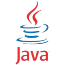
    
    
    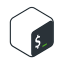
    
    
    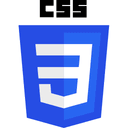
    

### 🤖 AI/ML & Data Science

    
    
    
    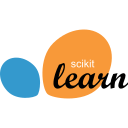
    
    
    
    
    
    
    
    
    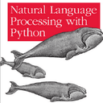
    
    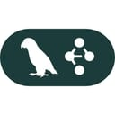
    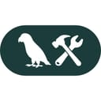
    
    
    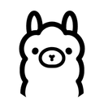
    
    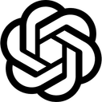
    
    
    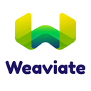

### 🌐 Frameworks & Libraries

    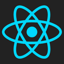
    
    
    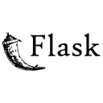
    
    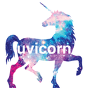
    
    
    
    
    

### 🗃️ Databases

    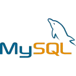
    
    
    
    
    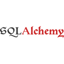

### 🛠️ DevOps & Tools

    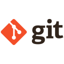
    
    
    
    
    
    
    
    
    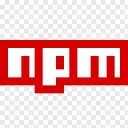
    

### 🖥️ IDEs & Editors

    
    
    
    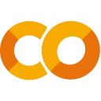
    
    

### 💻 Operating Systems & Security

    
    
    
    
    
    

# 🧪 GitHub Stats

  
  <picture>
    <source media="(prefers-color-scheme: dark)" srcset="https://github-profile-trophy.vercel.app/?username=GiuseppeBellamacina&title=MultipleLang,Repositories,Stars,Commits,Experience,Followers&theme=darkhub">
    
  </picture>
  
  

    
    
  

  
  <picture>
    <source media="(prefers-color-scheme: dark)" srcset="https://github-profile-summary-cards.vercel.app/api/cards/profile-details?username=GiuseppeBellamacina&theme=github_dark">
    
  </picture>
  
  <picture>
    <source media="(prefers-color-scheme: dark)" srcset="assets/github-snake.svg">
    
  </picture>

  <picture>
    <source media="(prefers-color-scheme: dark)" srcset="https://komarev.com/ghpvc/?username=GiuseppeBellamacina&label=Profile%20views&color=0e75b6&style=flat">
    
  </picture>
  

