# 💫 About Me

Hi there! 👋 I'm Giuseppe, a Computer Science student at the University of Catania. I'm passionate about Artificial Intelligence and Cybersecurity, always diving into new challenges and exploring the unknown. Most of the time, I just end up doing weird stuff because, well... Sbaddu Supecchiu.

I'm a huge fan of Marvel and Star Wars universe, but I’m just as obsessed with anime and way too many other things to list here. I also have a deep love for video games.

Oh, and I have a thing for cars. I drive. (Yes, I'm Ryan Gosling).

🚀 Always learning, always building.

# 🌐 Contacts

# 🚀 Working on

- **[Image Enhancement](https://github.com/GiuseppeBellamacina/Image-Enhancement)** - Exploring advanced techniques for image quality improvement
- **[Warehouse Swarm Intelligence System](https://github.com/GiuseppeBellamacina/Warehouse-Swarm-Intelligence-System)** - Designing a multi-agent system for optimizing warehouse operations
- **[GRPO Strict Code Generation](https://github.com/GiuseppeBellamacina/GRPO-strict-generation)** - RL-based LLM alignment for strict JSON/code generation
- **[Videogame-Semantic-Search](https://github.com/GiuseppeBellamacina/Videogame-Semantic-Search)** - NL-to-SPARQL semantic search on OWL 2 ontology
- An **AI to conquer the world** (I'm joking... maybe)
- **Survive**

# 💻 Tech Stack

| Category                      | Icons                                                                                                                                                                                                                                                                                                                                                                                                                                                                                                                                                                                                                                                                                                                                                                                                                                                                                                                                                                                                                                                                                                                                                                                                                                                                                                                                                                                                                                                                                                                                                                                                                                                                                                                                                                                                                                                                                                                                                                                                                                                                                                                                                                                                                                                                                                                                                                                                                                                                                                                                                                                                                                                                                                                                                                                                                                                                 |
| ----------------------------- | --------------------------------------------------------------------------------------------------------------------------------------------------------------------------------------------------------------------------------------------------------------------------------------------------------------------------------------------------------------------------------------------------------------------------------------------------------------------------------------------------------------------------------------------------------------------------------------------------------------------------------------------------------------------------------------------------------------------------------------------------------------------------------------------------------------------------------------------------------------------------------------------------------------------------------------------------------------------------------------------------------------------------------------------------------------------------------------------------------------------------------------------------------------------------------------------------------------------------------------------------------------------------------------------------------------------------------------------------------------------------------------------------------------------------------------------------------------------------------------------------------------------------------------------------------------------------------------------------------------------------------------------------------------------------------------------------------------------------------------------------------------------------------------------------------------------------------------------------------------------------------------------------------------------------------------------------------------------------------------------------------------------------------------------------------------------------------------------------------------------------------------------------------------------------------------------------------------------------------------------------------------------------------------------------------------------------------------------------------------------------------------------------------------------------------------------------------------------------------------------------------------------------------------------------------------------------------------------------------------------------------------------------------------------------------------------------------------------------------------------------------------------------------------------------------------------------------------------------------------------- |
| **🔤 Languages**              |     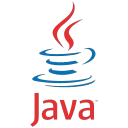   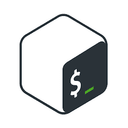   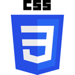                                                                                                                                                                                                                                                                                                                                                                                                                                                                                                                                                                                                                                                                                                                                                                                                                                                                                                                                                                                                                                                                                                                                                                                                                                                                                                                                                                                                                                                                                                                                                                                                                                                                                                                                                                                                                                                       |
| **🤖 AI/ML & Data Science**   |  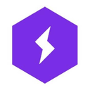    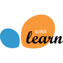          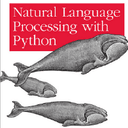 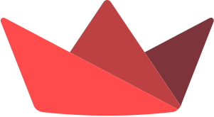   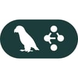 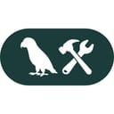   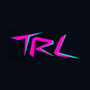   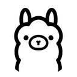 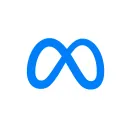 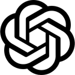  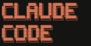  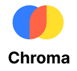 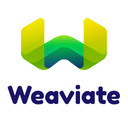 |
| **🌐 Frameworks & Libraries** |  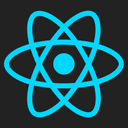 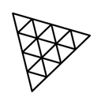   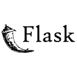 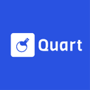                                                                                                                                                                                                                                                                                                                                                                                                                                                                                                                                                                                                                                                                                                                                                                                                                                                                                                                                                                                                                                                                                                                                                                                                                                                                                                                                                                                                                                                                                                                                                                                                                                                                                                                                                                                                                                                                                                                                          |
| **🗃️ Databases**              |     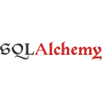  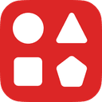                                                                                                                                                                                                                                                                                                                                                                                                                                                                                                                                                                                                                                                                                                                                                                                                                                                                                                                                                                                                                                                                                                                                                                                                                                                                                                                                                                                                                                                                                                                                                                                                                                                                                                                                                                                                                                                                                                                                                                                                                                                                                                                                                                                         |
| **🛠️ DevOps & Tools**         | 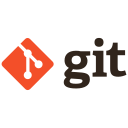     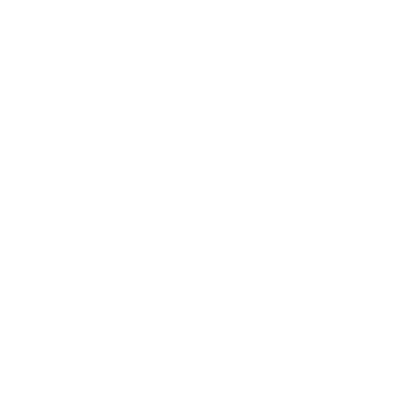 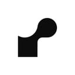      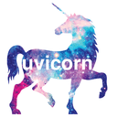 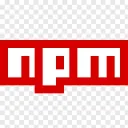                                                                                                                                                                                                                                                                                                                                                                                                                                                                                                                                                                                                                                                                                                                                                                                                                                                                                                                                                                                                                                                                                                                                                                                                                                                                                                                                                                                                                                                                                                                                           |
| **🖥️ IDEs & Editors**         |   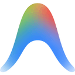   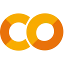                                                                                                                                                                                                                                                                                                                                                                                                                                                                                                                                                                                                                                                                                                                                                                                                                                                                                                                                                                                                                                                                                                                                                                                                                                                                                                                                                                                                                                                                                                                                                                                                                                                                                                                                                                                                                                                                                                                                                                                                                                                                                                                  |
| **💻 OS & Security**          |        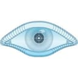                                                                                                                                                                                                                                                                                                                                                                                                                                                                                                                                                                                                                                                                                                                                                                                                                                                                                                                                                                                                                                                                                                                                                                                                                                                                                                                                                                                                                                                                                                                                                                                                                                                                                                                                                                                                                                                                                                                                                                                                                                                                                                                                                                    |

# 📊 GitHub Stats

<picture>
  <source media="(prefers-color-scheme: dark)" srcset="https://github-readme-stats.vercel.app/api?username=GiuseppeBellamacina&show_icons=true&count_private=true&theme=tokyonight&include_all_commits=true&hide_border=true">
  
</picture>
<picture>
  <source media="(prefers-color-scheme: dark)" srcset="https://github-readme-streak-stats.herokuapp.com/?user=GiuseppeBellamacina&theme=tokyonight&hide_border=true">
  
</picture>

  

<picture>
  <source media="(prefers-color-scheme: dark)" srcset="https://github-profile-summary-cards.vercel.app/api/cards/profile-details?username=GiuseppeBellamacina&theme=github_dark">
  
</picture>

